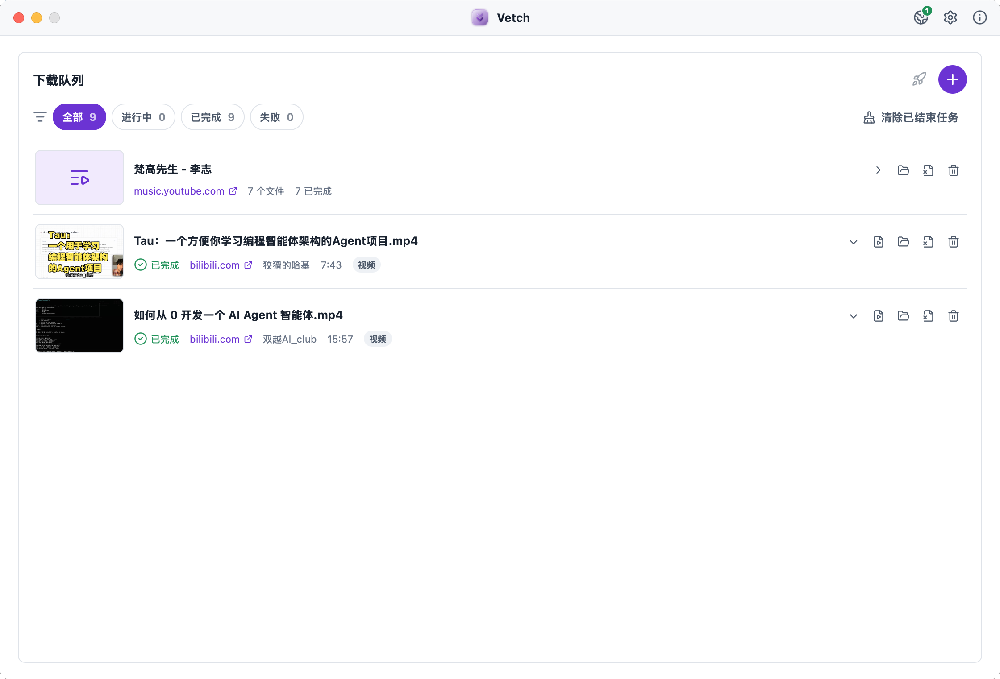
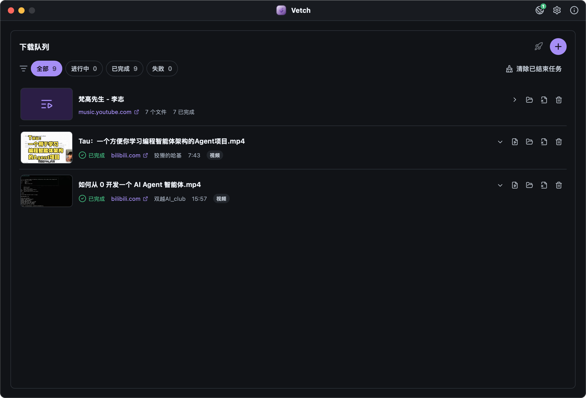
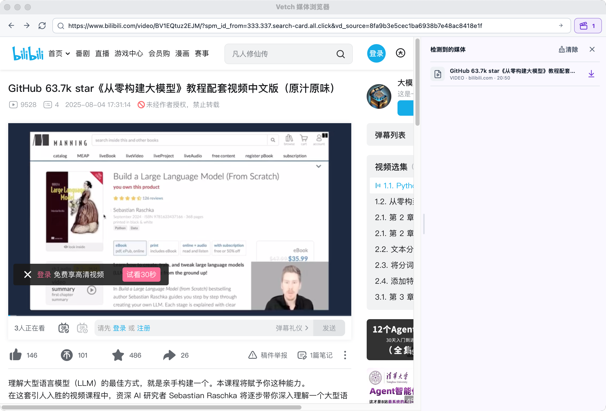
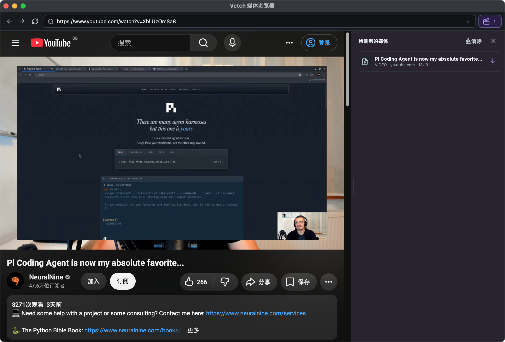

<div align="center">
  <a href="https://github.com/poneding/vetch">
    
  </a>

  <h1>Vetch</h1>

  <p>
    <strong>English</strong> | <a href="README.zh-CN.md">简体中文</a>
  </p>

  <p>
    A focused, powerful, cross-platform media downloader powered by.
  </p>

  <p>
    <a href="https://github.com/poneding/vetch/releases/latest"></a>
    <a href="https://github.com/poneding/vetch/actions/workflows/ci.yml"></a>
    <a href="LICENSE"></a>
    <a href="https://tauri.app"></a>
  </p>
</div>

## Screenshots

| | |
| --- | --- |
|  |  |
|  |  |

Download video and audio from **1000+ sites** through a clean desktop UI — paste a link, pick quality, done. No accounts, no analytics, everything stays on your machine.

The first screen is the download queue. Settings and About open as compact panels from the title bar.

## Features

- **1000+ sites** via yt-dlp — YouTube, Bilibili, TikTok, X, and more
- **Video & audio** with quality presets, containers, exact formats, and preferred languages
- **Playlists** with item selection and **manual refresh** for new entries
- **Pause / resume**, cancel, retry, live speed & ETA
- **Built-in media browser** that sniffs HLS / DASH / media from the page you browse
- **Cookies, proxy, concurrency**, filename templates, subtitles, metadata, chapters, thumbnails
- **Time-range clips** and per-download output options
- **Local-first** history & settings · light / dark / system themes
- **Optional update checks** against GitHub Releases

## Download

Installers for the latest release:

| Platform | Architecture | Artifact |
| --- | --- | --- |
| macOS 11+ | Apple Silicon (`arm64`) | `.dmg` |
| Windows | `x64` | `.msi` / NSIS `.exe` |
| Linux | `x64` | `.AppImage` / `.deb` / `.rpm` |

→ [GitHub Releases](https://github.com/poneding/vetch/releases/latest)

See the complete [platform support policy](docs/platform-support.md),
including source-build and unsupported-architecture details.

> **macOS:** CI builds are unsigned. On first open use right-click → Open, or run  
> `xattr -dr com.apple.quarantine /Applications/Vetch.app`.

## Development

**Requirements:** Node.js 22+, pnpm 11.1.2, Rust stable, and [Tauri prerequisites](https://v2.tauri.app/start/prerequisites/). The exact pnpm version is declared in `package.json` for Corepack.

```bash
pnpm install
pnpm run setup    # yt-dlp, FFmpeg, FFprobe, Deno for this OS/arch
pnpm run dev      # Tauri desktop app
```

```bash
pnpm run check    # lint + i18n + tsc + cargo check
pnpm test
pnpm run build    # production bundle
```

Tag a version (e.g. `v0.1.0`) to trigger multi-platform CI release builds. Changelog notes are generated with [git-cliff](https://git-cliff.org/).

## Contributing

Issues and pull requests are welcome. See [CONTRIBUTING.md](CONTRIBUTING.md).

Security vulnerabilities must be reported privately according to the
[security policy](SECURITY.md).

## Responsible use

Only download content that you are authorized to access and save. You are
responsible for complying with copyright law, the source website's terms, and
any other rules that apply to the content. Vetch does not grant rights to
third-party media or bypass the user's legal obligations.

## License

[MIT](LICENSE) © Vetch Contributors

Bundled third-party binaries and their source information remain under their
own licenses. See [third-party notices](THIRD_PARTY_NOTICES.md).
